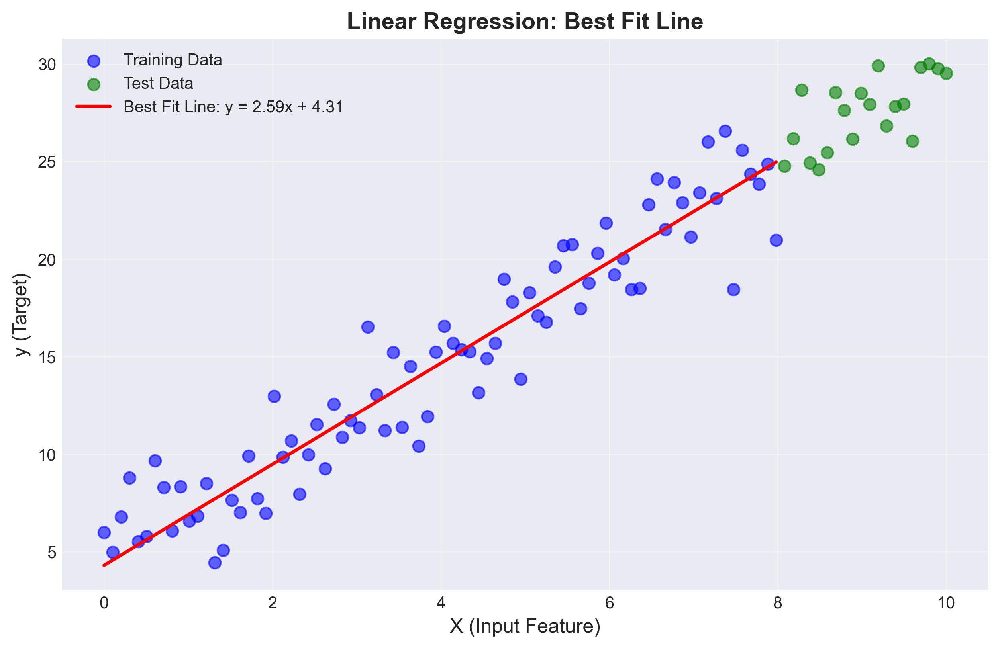
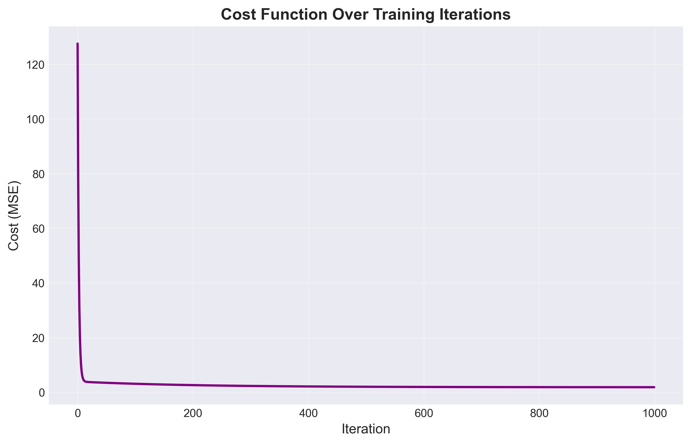
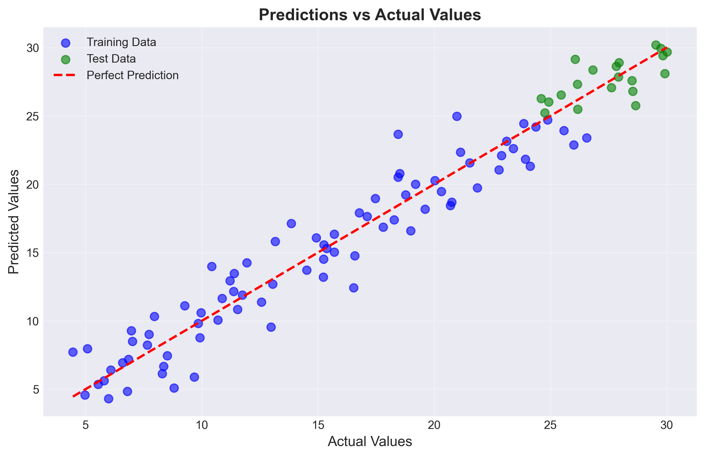
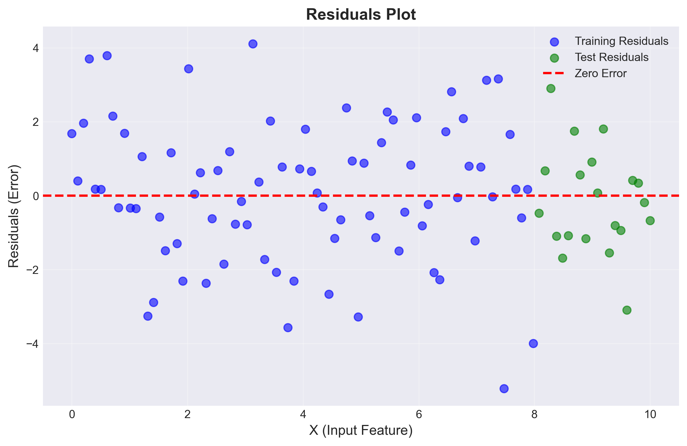

# 📐 Linear Regression: Your First Machine Learning Algorithm

Welcome to Linear Regression! This is often the first algorithm people learn in Machine Learning, and for good reason - it's simple, intuitive, and introduces fundamental concepts you'll use throughout your ML journey.

## 📑 Table of Contents
1. [What is Linear Regression?](#what-is-linear-regression)
2. [Why Do We Need It?](#why-do-we-need-it)
3. [Core Concepts](#core-concepts)
4. [The Mathematics](#the-mathematics)
5. [How It Works: Step by Step](#how-it-works-step-by-step)
6. [Types of Linear Regression](#types-of-linear-regression)
7. [Assumptions & Limitations](#assumptions--limitations)
8. [Evaluation Metrics](#evaluation-metrics)
9. [Visualizations](#visualizations)

---

## 🎯 What is Linear Regression?

**Linear Regression** is a supervised learning algorithm used to predict a **continuous output** based on one or more input features by finding the best-fitting straight line through the data.


### Real-World Example
Imagine you want to predict house prices based on their size:
- **Input (X)**: House size in square feet
- **Output (y)**: House price in dollars
- **Goal**: Find a line that best represents the relationship between size and price

---

## 💡 Why Do We Need It?

Linear Regression helps us:

1. **Make Predictions**: Estimate unknown values based on known data
   - Predict sales based on advertising spend
   - Forecast temperature based on historical data
   - Estimate salary based on years of experience

2. **Understand Relationships**: Quantify how variables relate to each other
   - How much does each additional square foot increase house price?
   - What's the impact of study hours on exam scores?

3. **Foundation for Advanced Algorithms**: Many complex ML algorithms build upon linear regression concepts

---

## 🔑 Core Concepts

### 1. **Variables**

**Independent Variable (X)** - The input feature(s)
- Also called: predictor, feature, input
- Example: House size, years of experience

**Dependent Variable (y)** - The output we want to predict
- Also called: target, output, response
- Example: House price, salary

### 2. **Weight (w) - The Slope**

The **weight** (or coefficient) determines how much the output changes when the input changes.

```
If w = 100, then for every 1 square foot increase in house size,
the price increases by $100
```

- **Positive weight**: As X increases, y increases
- **Negative weight**: As X increases, y decreases
- **Large weight**: Strong relationship between X and y
- **Small weight**: Weak relationship between X and y

### 3. **Bias (b) - The Intercept**

The **bias** (or intercept) is the value of y when all inputs are zero.

```
If b = 50,000, then a house with 0 square feet would theoretically
cost $50,000 (the base price)
```

Think of bias as the "starting point" of your line on the y-axis.

### 4. **Best Fit Line**

The **best fit line** is the line that minimizes the distance between the predicted values and the actual values in your training data.



---

## 📊 The Mathematics

### The Hypothesis Function

For **Simple Linear Regression** (one input feature):

```
ŷ = wx + b
```

Where:
- **ŷ** (y-hat) = predicted value
- **w** = weight (slope)
- **x** = input feature
- **b** = bias (intercept)

For **Multiple Linear Regression** (multiple input features):

```
ŷ = w₁x₁ + w₂x₂ + ... + wₙxₙ + b
```

Or in vector form:
```
ŷ = W^T · X + b
```

### The Cost Function (Mean Squared Error)

We need a way to measure how "wrong" our predictions are. We use the **Mean Squared Error (MSE)**:

```
J(w, b) = (1/2m) Σ(ŷᵢ - yᵢ)²
```

Where:
- **J** = cost (error)
- **m** = number of training examples
- **ŷᵢ** = predicted value for example i
- **yᵢ** = actual value for example i
- **Σ** = sum over all training examples

**Why squared error?**
1. Makes all errors positive (so they don't cancel out)
2. Penalizes larger errors more heavily
3. Makes the math easier for optimization

**Visual Interpretation:**
The cost function measures the average squared vertical distance between the predicted line and the actual data points.

### Gradient Descent: Finding the Best Parameters

**Gradient Descent** is an optimization algorithm that finds the values of w and b that minimize the cost function.

**The Algorithm:**

1. Start with random values for w and b
2. Calculate the cost J(w, b)
3. Update w and b to reduce the cost
4. Repeat until convergence

**Update Rules:**

```
w = w - α · (∂J/∂w)
b = b - α · (∂J/∂b)
```

Where **α** (alpha) is the **learning rate** - how big of a step we take.

**Computing the Gradients:**

The partial derivatives tell us which direction to move:

```
∂J/∂w = (1/m) Σ(ŷᵢ - yᵢ) · xᵢ
∂J/∂b = (1/m) Σ(ŷᵢ - yᵢ)
```

**Step-by-Step Gradient Descent:**

```
For each iteration:
  1. Calculate predictions: ŷᵢ = wxᵢ + b for all examples
  2. Calculate error: error = ŷᵢ - yᵢ
  3. Calculate gradients:
     dw = (1/m) Σ(error · xᵢ)
     db = (1/m) Σ(error)
  4. Update parameters:
     w = w - α · dw
     b = b - α · db
  5. Calculate new cost J(w, b)
  6. Repeat until cost stops decreasing significantly
```

### Learning Rate (α)

The **learning rate** controls how fast we learn:

- **Too small**: Learning is very slow, takes many iterations
- **Too large**: We might overshoot the minimum and never converge
- **Just right**: Efficient convergence to the minimum


---

## 🔄 How It Works: Step by Step

Let's walk through a complete example:

### Example: Predicting House Prices

**Given Data:**
| Size (sq ft) | Price ($1000s) |
|--------------|----------------|
| 1000         | 200            |
| 1500         | 250            |
| 2000         | 300            |
| 2500         | 350            |

**Step 1: Initialize Parameters**
```
w = 0 (random)
b = 0 (random)
α = 0.01 (learning rate)
```

**Step 2: Make Initial Predictions**
```
For x = 1000: ŷ = 0(1000) + 0 = 0
Actual y = 200
Error = 0 - 200 = -200
```

**Step 3: Calculate Gradients**
```
dw = (1/4) Σ(error · x) = (1/4)[(-200·1000) + (-250·1500) + ...]
db = (1/4) Σ(error) = (1/4)[(-200) + (-250) + ...]
```

**Step 4: Update Parameters**
```
w = w - α · dw
b = b - α · db
```

**Step 5: Repeat**
Continue until the cost function stops decreasing significantly.

**Final Result:**
After many iterations, we might get:
```
w ≈ 0.1 (for every sq ft, price increases by $100)
b ≈ 100 (base price is $100,000)

Prediction formula: Price = 0.1 · Size + 100
```

---

## 📚 Types of Linear Regression

### 1. Simple Linear Regression
- **One input feature**
- Equation: `ŷ = wx + b`
- Example: Predict salary from years of experience

### 2. Multiple Linear Regression
- **Multiple input features**
- Equation: `ŷ = w₁x₁ + w₂x₂ + ... + wₙxₙ + b`
- Example: Predict house price from size, bedrooms, location, age

---

## ⚠️ Assumptions & Limitations

### Assumptions

Linear Regression assumes:

1. **Linearity**: The relationship between X and y is linear
2. **Independence**: Observations are independent of each other
3. **Homoscedasticity**: Constant variance of errors
4. **Normality**: Errors are normally distributed
5. **No Multicollinearity**: Input features are not highly correlated (for multiple regression)

### When Linear Regression Works Well

✅ Relationship between variables is approximately linear  
✅ You have enough data  
✅ Features are not highly correlated  
✅ You want an interpretable model  

### When It Doesn't Work Well

❌ Relationship is highly non-linear  
❌ Outliers heavily influence the model  
❌ Features have complex interactions  
❌ You need to model categorical outcomes (use Logistic Regression instead)  

---

## 📏 Evaluation Metrics

### 1. Mean Squared Error (MSE)
```
MSE = (1/m) Σ(ŷᵢ - yᵢ)²
```
- Average squared difference between predictions and actual values
- **Lower is better**
- Units are squared (e.g., dollars²)

### 2. Root Mean Squared Error (RMSE)
```
RMSE = √MSE
```
- Square root of MSE
- **Lower is better**
- Same units as the target variable (easier to interpret)

### 3. R² Score (Coefficient of Determination)
```
R² = 1 - (SS_res / SS_tot)

Where:
SS_res = Σ(yᵢ - ŷᵢ)²  (residual sum of squares)
SS_tot = Σ(yᵢ - ȳ)²   (total sum of squares)
ȳ = mean of actual values
```

- Measures how well the model explains the variance in the data
- **Range**: 0 to 1 (can be negative for very poor models)
- **Interpretation**:
  - R² = 1: Perfect predictions
  - R² = 0.8: Model explains 80% of variance
  - R² = 0: Model is no better than predicting the mean

---

## 📈 Visualizations Explained

Our implementations generate several visualizations to help you understand Linear Regression. Here's a detailed explanation of each plot and the math behind it:

---

### 1. **Best Fit Line Plot**


**What it shows:**
- Scatter plot of actual data points (blue/green dots)
- The learned regression line (red line)
- The equation of the line: y = wx + b

**Mathematical Foundation:**

The best fit line is determined by the parameters (w, b) that minimize the cost function:

```
Line equation: ŷ = wx + b

Where:
- w = learned weight (slope)
- b = learned bias (intercept)
- ŷ = predicted value
```

**How to interpret:**
- **Close clustering**: Points near the line indicate good predictions
- **Scattered points**: Points far from the line indicate poor fit
- **Slope (w)**: Steeper line = stronger relationship
- **Intercept (b)**: Where the line crosses the y-axis

**What to look for:**
✅ Points should cluster around the line  
✅ No obvious curved patterns (would indicate non-linearity)  
✅ Roughly equal scatter above and below the line  

---

### 2. **Cost Function Over Iterations**



**What it shows:**
- How the cost (error) decreases as training progresses
- X-axis: Iteration number
- Y-axis: Cost value (MSE)

**Mathematical Foundation:**

The cost function (Mean Squared Error) at each iteration:

```
J(w, b) = (1/2m) Σ(ŷᵢ - yᵢ)²

Where:
- J = cost (total error)
- m = number of training examples
- ŷᵢ = predicted value for example i
- yᵢ = actual value for example i
- Σ = sum over all examples
```

**Gradient Descent Updates:**

At each iteration, parameters are updated:

```
w = w - α · (∂J/∂w)
b = b - α · (∂J/∂b)

Where:
- α = learning rate
- ∂J/∂w = gradient with respect to weight
- ∂J/∂b = gradient with respect to bias
```

**How to interpret:**
- **Steep initial drop**: Model is learning quickly
- **Gradual flattening**: Model is converging
- **Flat line at end**: Model has converged (optimal parameters found)

**What to look for:**
✅ **Smooth decrease**: Indicates proper learning  
✅ **Convergence**: Cost should plateau (stop decreasing)  
❌ **Oscillations**: Learning rate might be too high  
❌ **Increasing cost**: Something is wrong (bad learning rate or bug)  
❌ **No decrease**: Learning rate too small or model can't fit data  

**Troubleshooting:**
- If cost increases: Reduce learning rate
- If cost decreases very slowly: Increase learning rate or iterations
- If cost oscillates: Reduce learning rate

---

### 3. **Predictions vs Actual Values**



**What it shows:**
- X-axis: Actual values (ground truth)
- Y-axis: Predicted values (model output)
- Diagonal line: Perfect prediction line (y = x)
- Blue dots: Training data
- Green dots: Test data

**Mathematical Foundation:**

Each point represents:

```
Point (x, y) where:
- x = yᵢ (actual value)
- y = ŷᵢ (predicted value)

Perfect prediction: ŷᵢ = yᵢ (point on diagonal)
```

**R² Score Calculation:**

```
R² = 1 - (SS_res / SS_tot)

Where:
SS_res = Σ(yᵢ - ŷᵢ)²  (residual sum of squares)
SS_tot = Σ(yᵢ - ȳ)²   (total sum of squares)
ȳ = mean of actual values

Interpretation:
- R² = 1.0: Perfect predictions (all points on diagonal)
- R² = 0.8: Model explains 80% of variance
- R² = 0.0: Model no better than predicting the mean
- R² < 0: Model worse than predicting the mean
```

**How to interpret:**
- **Points on diagonal**: Perfect predictions
- **Points above diagonal**: Model over-predicts (ŷ > y)
- **Points below diagonal**: Model under-predicts (ŷ < y)
- **Tight cluster**: High accuracy (high R²)
- **Wide scatter**: Low accuracy (low R²)

**What to look for:**
✅ **Points close to diagonal**: Good model performance  
✅ **Similar scatter for training and test**: Good generalization  
❌ **Systematic bias** (all above or below): Model has bias issue  
❌ **Training tight, test scattered**: Overfitting  
❌ **Fan shape**: Heteroscedasticity (variance increases with value)  

---

### 4. **Residuals Plot**



**What it shows:**
- X-axis: Predicted values (ŷ) or input features (X)
- Y-axis: Residuals (errors)
- Horizontal line at y=0: Perfect prediction line
- Blue dots: Training residuals
- Green dots: Test residuals

**Mathematical Foundation:**

Residual for each prediction:

```
Residual = eᵢ = yᵢ - ŷᵢ

Where:
- eᵢ = error (residual) for example i
- yᵢ = actual value
- ŷᵢ = predicted value

Properties of good residuals:
1. Mean(e) ≈ 0 (unbiased)
2. Variance(e) = constant (homoscedastic)
3. e ~ Normal distribution
4. No patterns or correlations
```

**Why residuals matter:**

Residuals reveal model assumptions:

```
Assumptions checked:
1. Linearity: Random scatter (no curves)
2. Homoscedasticity: Constant spread
3. Independence: No patterns
4. Normality: Bell-shaped distribution
```

**How to interpret:**

**Residual patterns and their meanings:**

1. **Random scatter around zero** ✅
   - Model is appropriate
   - Assumptions are met
   - Good predictions

2. **Curved pattern** ❌
   - Non-linear relationship exists
   - Need polynomial features or different model

3. **Funnel shape** (increasing spread) ❌
   - Heteroscedasticity
   - Variance increases with predicted value
   - Consider log transformation

4. **Systematic bias** (all positive or negative) ❌
   - Model consistently over/under-predicts
   - Missing important features

5. **Outliers** (points far from zero) ⚠️
   - Unusual data points
   - May need investigation or removal

**What to look for:**
✅ **Random scatter**: No obvious patterns  
✅ **Centered at zero**: Mean of residuals ≈ 0  
✅ **Constant spread**: Similar variance across predictions  
✅ **Symmetric distribution**: Equal scatter above/below zero  

❌ **Curved patterns**: Indicates non-linearity  
❌ **Funnel shape**: Heteroscedasticity problem  
❌ **Clusters or gaps**: Missing variables  
❌ **Outliers**: Data quality issues  

**Diagnostic actions:**

| Pattern | Problem | Solution |
|---------|---------|----------|
| Curve | Non-linear relationship | Add polynomial features |
| Funnel | Heteroscedasticity | Log transform target |
| Systematic bias | Missing features | Add more features |
| Outliers | Data quality | Investigate/remove outliers |
| Clusters | Categorical variable | Add categorical features |

---

### 5. **Feature Importance (Multiple Linear Regression)**

**What it shows:**
- Horizontal bar chart of learned weights
- Green bars: Positive weights (increase target)
- Red bars: Negative weights (decrease target)
- Length: Magnitude of impact

**Mathematical Foundation:**

For multiple linear regression:

```
ŷ = w₁x₁ + w₂x₂ + ... + wₙxₙ + b

Feature importance = |wᵢ|

Where:
- wᵢ = weight for feature i
- |wᵢ| = absolute value (magnitude)
- Larger |wᵢ| = more important feature
```

**Important Note:**

Weights are only comparable when features are normalized!

```
Normalized feature: x_norm = (x - mean) / std

After normalization:
- All features have mean = 0, std = 1
- Weights directly indicate importance
```

**How to interpret:**
- **Large positive weight**: Feature strongly increases target
- **Large negative weight**: Feature strongly decreases target
- **Small weight**: Feature has minimal impact
- **Zero weight**: Feature is irrelevant

**What to look for:**
✅ Identify most important features  
✅ Remove features with near-zero weights  
✅ Understand domain relationships  

---

### 6. **Feature Correlations (Multiple Linear Regression)**

**What it shows:**
- Multiple scatter plots
- Each plot: One feature vs target
- Shows individual feature-target relationships

**Mathematical Foundation:**

Pearson correlation coefficient:

```
r = Σ[(xᵢ - x̄)(yᵢ - ȳ)] / √[Σ(xᵢ - x̄)² · Σ(yᵢ - ȳ)²]

Where:
- r = correlation (-1 to +1)
- x̄ = mean of feature
- ȳ = mean of target

Interpretation:
- r = +1: Perfect positive correlation
- r = 0: No correlation
- r = -1: Perfect negative correlation
```

**How to interpret:**
- **Upward trend**: Positive correlation
- **Downward trend**: Negative correlation
- **No trend**: No linear relationship
- **Tight cluster**: Strong correlation
- **Wide scatter**: Weak correlation

**What to look for:**
✅ Strong correlations indicate useful features  
✅ Non-linear patterns suggest feature engineering  
❌ No correlation suggests feature might be useless  

---

## 📊 Visualization Summary

| Plot | Purpose | Key Metric | Good Sign |
|------|---------|------------|-----------|
| **Best Fit Line** | Show model fit | Visual inspection | Points near line |
| **Cost History** | Training progress | Decreasing J(w,b) | Smooth decrease |
| **Predictions vs Actual** | Model accuracy | R² score | Points on diagonal |
| **Residuals** | Assumption checking | Random scatter | No patterns |
| **Feature Importance** | Feature selection | Weight magnitude | Clear differences |
| **Feature Correlations** | Relationship analysis | Correlation r | Strong trends |

---

## 🔍 Using Visualizations for Debugging

**Problem**: Model not learning (cost not decreasing)
- Check: Cost history plot
- Solution: Adjust learning rate or increase iterations

**Problem**: Poor predictions
- Check: Predictions vs Actual plot
- Solution: Add more features or try non-linear model

**Problem**: Model works on training but not test
- Check: Compare training vs test in all plots
- Solution: Reduce overfitting (more data, simpler model)

**Problem**: Predictions biased
- Check: Residuals plot for systematic patterns
- Solution: Add missing features or transform data

---

## 🚀 Next Steps

### Key Takeaways

✅ Linear Regression finds the best line through data  
✅ **Weight (w)** controls the slope  
✅ **Bias (b)** controls the intercept  
✅ **Cost Function** measures prediction error  
✅ **Gradient Descent** finds optimal parameters  
✅ **Learning Rate** controls how fast we learn  

---

