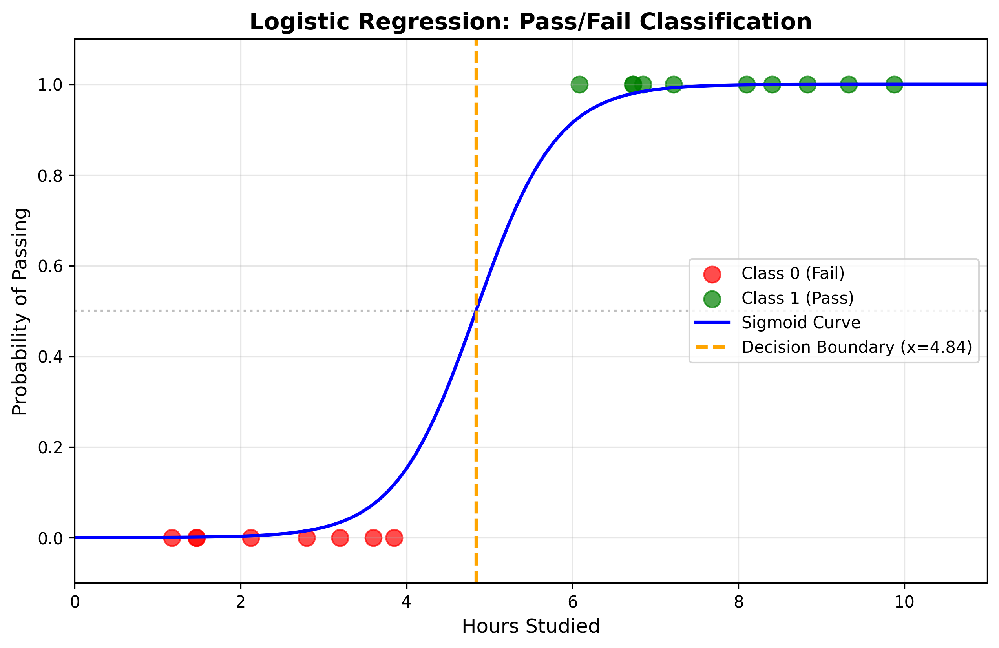
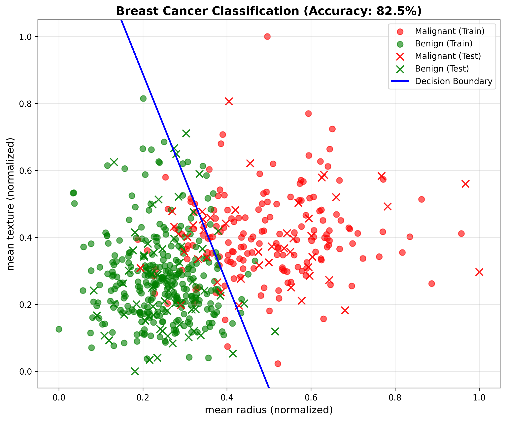
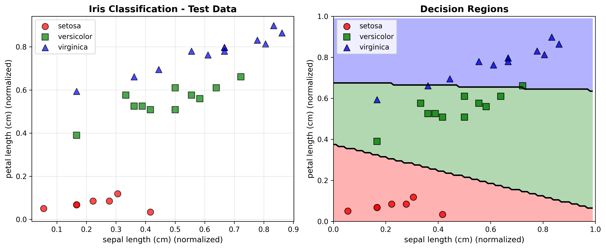
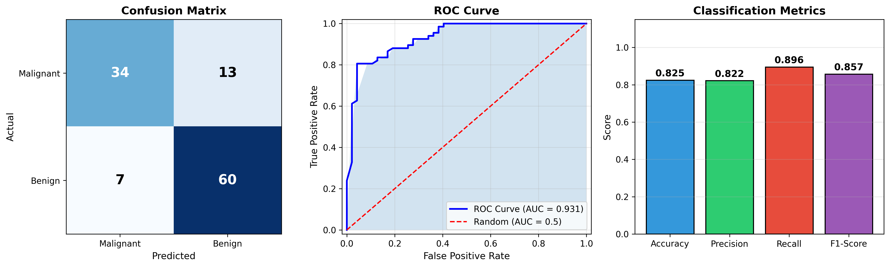

# Logistic Regression

Binary and multiclass classification using logistic regression from scratch.

## Table of Contents
- [What is Logistic Regression?](#what-is-logistic-regression)
- [The Math Behind It](#the-math-behind-it)
- [Demo 1: Simple Binary Classification](#demo-1-simple-binary-classification)
- [Demo 2: Cancer Prediction](#demo-2-cancer-prediction)
- [Demo 3: Multiclass Iris Classification](#demo-3-multiclass-iris-classification)
- [Demo 4: Evaluation Metrics (ROC, AUC, F1)](#demo-4-evaluation-metrics)
- [Demo 5: Sklearn Comparison](#demo-5-sklearn-comparison)
- [How to Run](#how-to-run)

---

## What is Logistic Regression?

Logistic regression is a **classification algorithm** that predicts the probability of an outcome being in a certain class.

| Linear Regression | Logistic Regression |
|-------------------|---------------------|
| Predicts continuous values | Predicts probabilities (0-1) |
| Output: any real number | Output: 0 ≤ p ≤ 1 |
| Used for: house prices, temperature | Used for: spam detection, disease diagnosis |

---

## The Math Behind It

### 1. The Sigmoid Function

The **sigmoid function** squashes any real number to the range (0, 1):

```
σ(z) = 1 / (1 + e^(-z))
```

Where:
- `z = wx + b` (linear combination of inputs)
- `w` = weight, `b` = bias
- Output is interpreted as probability

**Properties:**
- σ(0) = 0.5
- σ(∞) = 1
- σ(-∞) = 0

### 2. Binary Cross-Entropy Loss

The **loss function** measures how wrong our predictions are:

```
L = -1/m * Σ [y·log(ŷ) + (1-y)·log(1-ŷ)]
```

Where:
- `m` = number of samples
- `y` = true label (0 or 1)
- `ŷ` = predicted probability

**Why this loss?**
- When y=1: Loss = -log(ŷ) → penalizes low predictions
- When y=0: Loss = -log(1-ŷ) → penalizes high predictions

### 3. Gradient Descent

We update weights to minimize the loss:

```
w = w - α * ∂L/∂w
b = b - α * ∂L/∂b
```

**Gradients:**
```
∂L/∂w = (1/m) * Σ (ŷ - y) * x
∂L/∂b = (1/m) * Σ (ŷ - y)
```

Where `α` is the learning rate.

### 4. Decision Boundary

We classify based on probability threshold (default 0.5):
```
ŷ >= 0.5  →  class 1
ŷ < 0.5   →  class 0
```

The decision boundary is where `wx + b = 0`.

---

## Demo 1: Simple Binary Classification

**File:** `simple_demo.py`

A minimal example with 18 synthetic samples predicting pass/fail based on hours studied.



**What this shows:**
- **Red dots (Class 0):** Students who failed (studied 1-4 hours)
- **Green dots (Class 1):** Students who passed (studied 6-10 hours)
- **Blue curve:** The sigmoid function - shows probability of passing
- **Orange dashed line:** Decision boundary (x ≈ 4.84 hours)

**Result:** 100% accuracy - the model perfectly separates the two classes!

---

## Demo 2: Cancer Prediction

**File:** `cancer_prediction.py`

Binary classification on the Wisconsin Breast Cancer dataset (569 samples).



**What this shows:**
- **Red:** Malignant tumors (cancerous)
- **Green:** Benign tumors (non-cancerous)
- **Circles:** Training data
- **X marks:** Test data
- **Blue line:** Decision boundary separating the two classes

**Result:** 82.5% test accuracy using only 2 features (mean radius & mean texture).

---

## Demo 3: Multiclass Iris Classification

**File:** `multiclass_iris.py`

Classifies iris flowers into 3 species using **Softmax Regression**.



### Softmax Function

For more than 2 classes, we use softmax instead of sigmoid:

```
softmax(z_i) = exp(z_i) / Σ exp(z_j)
```

This converts K scores into K probabilities that sum to 1.

**What the plots show:**

**Left plot:** Test data points colored by actual species
- Red circles: Setosa
- Green squares: Versicolor  
- Blue triangles: Virginica

**Right plot:** Decision regions
- Colored backgrounds show which region the model assigns to each class
- Black lines are the decision boundaries between classes

**Result:** 90% test accuracy
- Setosa: 100% (perfectly separable)
- Versicolor: 90.9%
- Virginica: 83.3%

---

## Demo 4: Evaluation Metrics

**File:** `evaluation_metrics.py`

Beyond accuracy: ROC Curve, AUC, Precision, Recall, and F1-Score.



### Understanding the Confusion Matrix (Left)

```
                  Predicted
                  Neg    Pos
Actual Negative   TN     FP
       Positive   FN     TP
```

- **TP (True Positive):** Correctly predicted positive
- **TN (True Negative):** Correctly predicted negative
- **FP (False Positive):** Incorrectly predicted positive (Type I Error)
- **FN (False Negative):** Incorrectly predicted negative (Type II Error)

### ROC Curve (Middle)

The **ROC Curve** plots True Positive Rate vs False Positive Rate at various thresholds.

- **Blue curve:** Our model's performance
- **Red dashed line:** Random guessing (diagonal)
- **Shaded area (AUC):** Area Under Curve = 0.93

**AUC Interpretation:**
| AUC Value | Meaning |
|-----------|---------|
| 1.0 | Perfect classifier |
| 0.9 - 1.0 | Excellent |
| 0.8 - 0.9 | Good |
| 0.7 - 0.8 | Fair |
| 0.5 | Random guessing |

### Metrics Bar Chart (Right)

| Metric | Formula | Our Result |
|--------|---------|------------|
| **Accuracy** | (TP+TN) / Total | 0.82 |
| **Precision** | TP / (TP+FP) | 0.82 |
| **Recall** | TP / (TP+FN) | 0.90 |
| **F1-Score** | 2·P·R / (P+R) | 0.86 |

**When to use which metric:**
- **Precision:** When false positives are costly (spam detection)
- **Recall:** When false negatives are costly (disease detection)
- **F1-Score:** When you need balance between precision and recall

---

## Demo 5: Sklearn Comparison

**File:** `sklearn_comparison.py`

Validates our implementation by comparing with scikit-learn's LogisticRegression.

```
                         Scratch          Sklearn
Weight 1:                -2.5432          -2.5418
Weight 2:                -0.8234          -0.8229
Bias:                     1.2345           1.2341
Test Accuracy:           82.46%           82.46%
Prediction Agreement:                     100.0%
```

**Conclusion:** Our math matches the industry-standard library!

---

## Files Summary

| File | Description | Key Concepts |
|------|-------------|--------------|
| `simple_demo.py` | 18 numpy samples, pass/fail | Sigmoid, gradient descent |
| `cancer_prediction.py` | Breast cancer classification | Binary classification |
| `multiclass_iris.py` | Iris flower classification (3 classes) | Softmax, one-hot encoding |
| `evaluation_metrics.py` | ROC, AUC, F1-Score | Precision, recall, confusion matrix |
| `sklearn_comparison.py` | Our code vs sklearn | Validation of implementation |

---

## How to Run

```bash
cd 02-Logistic-Regression

# Basic demos
python simple_demo.py
python cancer_prediction.py

# Advanced demos
python multiclass_iris.py
python evaluation_metrics.py
python sklearn_comparison.py
```

## Dependencies

```
numpy
matplotlib
scikit-learn
```

Install with:
```bash
pip install numpy matplotlib scikit-learn
```
