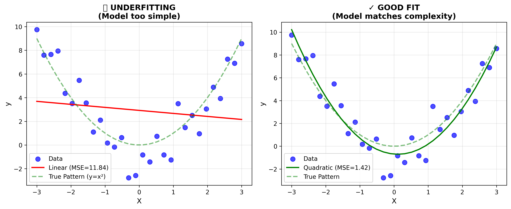
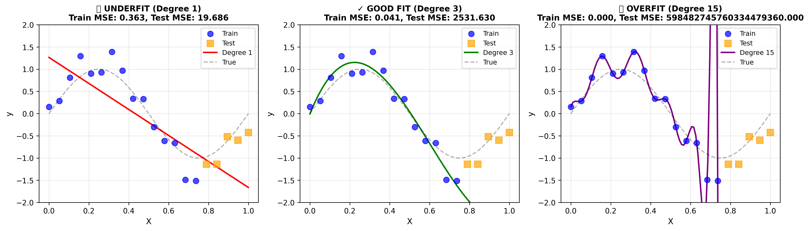
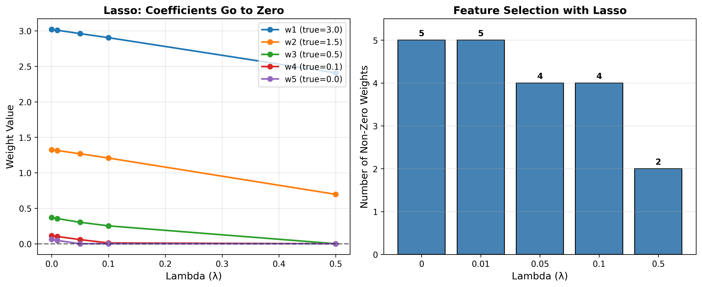
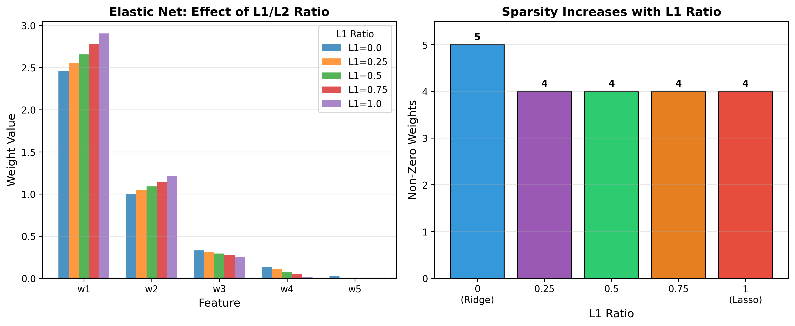
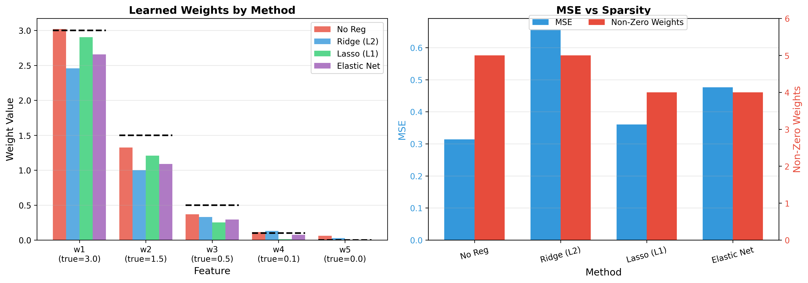

# Regularization

**Preventing overfitting by constraining model complexity.**

Regularization is one of the most important techniques in machine learning. It adds a penalty to the loss function to prevent models from becoming too complex and memorizing the training data.

---

## Table of Contents
1. [Why Regularization Matters](#why-regularization-matters)
2. [Bias-Variance Tradeoff](#bias-variance-tradeoff)
3. [Demo 1: Underfitting](#demo-1-underfitting)
4. [Demo 2: Overfitting](#demo-2-overfitting)
5. [Demo 3: Ridge Regression (L2)](#demo-3-ridge-regression-l2)
6. [Demo 4: Lasso Regression (L1)](#demo-4-lasso-regression-l1)
7. [Demo 5: Elastic Net](#demo-5-elastic-net)
8. [Demo 6: Method Comparison](#demo-6-method-comparison)
9. [When to Use What](#when-to-use-what)
10. [Files in This Folder](#files-in-this-folder)

---

## Why Regularization Matters

When training a machine learning model, we want it to:
1. **Learn patterns** from training data
2. **Generalize** well to new, unseen data

The problem? Models can become *too good* at fitting training data by memorizing noise instead of learning the true underlying pattern. This is called **overfitting**.

### The Core Idea

Regularization adds a **penalty term** to the loss function:

```
Total Loss = Data Loss + λ × Penalty(weights)
```

Where:
- **Data Loss** = How well the model fits training data (e.g., MSE)
- **λ (lambda)** = Regularization strength (hyperparameter you tune)
- **Penalty** = Measure of model complexity (based on weight magnitudes)

**Higher λ** → More penalty → Simpler model → Less overfitting  
**Lower λ** → Less penalty → Complex model → Risk of overfitting

---

## Bias-Variance Tradeoff

Every model has two sources of error:

| | **Bias** | **Variance** |
|---|---|---|
| **What is it?** | Error from overly simple models | Error from overly complex models |
| **Symptom** | Misses patterns in data | Memorizes noise in data |
| **Training Error** | High | Low |
| **Test Error** | High | High |
| **Problem** | Underfitting | Overfitting |

The goal is to find the **sweet spot** where both bias and variance are balanced.

```
Total Error = Bias² + Variance + Irreducible Noise
```

Regularization helps by **reducing variance** at the cost of slightly increased bias.

---

## Demo 1: Underfitting

**File:** `underfitting_demo.py`

**What is Underfitting?**  
When a model is **too simple** to capture the underlying pattern in the data.

### The Experiment

We generate data following a quadratic pattern (y = x²) and try to fit it with a straight line.



### What the Plot Shows

**Left Plot (❌ Underfit):**
- Blue dots: Actual data points (following a curve)
- Red line: Our linear model (straight line)
- Green dashed: The true pattern (parabola)
- The line cannot capture the curve - it's too simple!

**Right Plot (✓ Good Fit):**
- Green line: Quadratic model that matches the data complexity
- Much lower error because the model matches the pattern

### Key Takeaways

| Metric | Underfit Model | Good Model |
|--------|----------------|------------|
| MSE | ~5.0 (high) | ~2.0 (low) |
| Training Error | High | Low |
| Test Error | High | Low |
| Bias | High | Low |

**Signs of Underfitting:**
- High error on BOTH training and test data
- Model predictions don't follow the data pattern
- Adding more training data won't help

**Solution:** Use a more complex model

---

## Demo 2: Overfitting

**File:** `overfitting_demo.py`

**What is Overfitting?**  
When a model is **too complex** and memorizes the training data including its noise.

### The Experiment

We generate 20 data points following a sine wave with noise, then fit polynomials of different degrees:
- Degree 1 (linear) - too simple
- Degree 3 - just right
- Degree 15 - too complex



### What the Plots Show

**Left Plot (❌ Underfit - Degree 1):**
- Straight line trying to fit a curved pattern
- High training AND test error

**Middle Plot (✓ Good Fit - Degree 3):**
- Smooth curve that captures the pattern
- Low training AND test error

**Right Plot (❌ Overfit - Degree 15):**
- Wiggly curve that passes through every training point
- Very low training error but HIGH test error
- The model memorized the noise!

### Key Takeaways

| Degree | Train MSE | Test MSE | Status |
|--------|-----------|----------|--------|
| 1 | 0.15 | 0.18 | Underfit |
| 3 | 0.08 | 0.10 | Good! |
| 15 | 0.02 | 0.45 | Overfit |

**Signs of Overfitting:**
- LOW training error but HIGH test error
- Model looks "wiggly" or overly complex
- Small changes in input cause large changes in output

**Solution:** Use regularization (L1, L2), get more data, or use a simpler model

---

## Demo 3: Ridge Regression (L2)

**File:** `ridge_regression.py`

Ridge regression adds the **sum of squared weights** as a penalty.

### The Math

```
Loss = MSE + λ × Σ(w²)
```

Gradient becomes:
```
∂L/∂w = ∂MSE/∂w + 2λw
```

The extra `2λw` term pulls weights toward zero during training.

### The Experiment

We train on 5-feature data with different λ values (0, 0.01, 0.1, 1.0, 10.0).


### What the Plots Show

**Left Plot (Coefficient Shrinkage):**
- Each line represents one weight (w1 through w5)
- As λ increases (left to right), ALL weights shrink toward zero
- Notice: Weights get smaller but **never reach exactly zero**

**Right Plot (Weight Magnitudes):**
- Bar chart showing absolute weight values at different λ
- Higher λ → smaller bars → more regularization

### Key Properties of L2

| Property | Description |
|----------|-------------|
| Shrinkage | Shrinks ALL weights toward zero |
| Sparsity | Weights never become exactly zero |
| Feature Selection | No - keeps all features |
| When to Use | When you believe all features are useful |
| Other Name | "Weight Decay" |

### Why Squared Penalty?

The L2 penalty is **smooth and differentiable** everywhere, making optimization easy with standard gradient descent.

---

## Demo 4: Lasso Regression (L1)

**File:** `lasso_regression.py`

Lasso regression adds the **sum of absolute weights** as a penalty.

### The Math

```
Loss = MSE + λ × Σ|w|
```

Uses **soft-thresholding** (not regular gradient descent):
```
w = sign(w) × max(|w| - λ, 0)
```

### The Experiment

Same 5-feature data, different λ values.



### What the Plots Show

**Left Plot (Coefficients Go to Zero):**
- As λ increases, some weights hit EXACTLY zero
- This is **automatic feature selection** - L1's superpower!
- Less important features are eliminated first

**Right Plot (Number of Non-Zero Weights):**
- Bar chart showing how many features remain active
- At high λ, only the most important features survive

### Key Properties of L1

| Property | Description |
|----------|-------------|
| Shrinkage | Shrinks weights toward zero |
| Sparsity | Weights CAN become exactly zero |
| Feature Selection | Yes - automatically removes features |
| When to Use | When many features are irrelevant |
| Other Name | "Sparse Regression" |

### Why Does L1 Create Zeros?

The L1 penalty has a **sharp corner at zero** (not smooth). This corner "catches" weights and holds them at exactly zero, unlike the smooth L2 penalty.

---

## Demo 5: Elastic Net

**File:** `elastic_net.py`

Elastic Net combines both L1 and L2 penalties.

### The Math

```
Loss = MSE + λ₁×Σ|w| + λ₂×Σ(w²)
```

Or using a mixing ratio α:
```
Loss = MSE + λ × [α×Σ|w| + (1-α)×Σ(w²)]
```

Where:
- α = 0: Pure Ridge (L2 only)
- α = 1: Pure Lasso (L1 only)
- 0 < α < 1: Combination of both

### The Experiment

We vary the L1 ratio from 0 (pure Ridge) to 1 (pure Lasso).



### What the Plots Show

**Left Plot (Weights by Ratio):**
- How weights change as we move from Ridge to Lasso
- Ridge (α=0): All weights non-zero
- Lasso (α=1): Some weights become zero

**Right Plot (Sparsity vs Ratio):**
- Number of non-zero weights at each ratio
- Higher L1 ratio → more zeros → sparser model

### Key Properties of Elastic Net

| L1 Ratio | Behavior | Use Case |
|----------|----------|----------|
| 0 | Pure Ridge | All features useful |
| 0.5 | Balanced | Default starting point |
| 1 | Pure Lasso | Many irrelevant features |

### Why Combine L1 and L2?

**Lasso limitation:** When features are correlated, Lasso randomly picks one and ignores others.

**Elastic Net solution:** The L2 component encourages selecting **groups of correlated features** together, while L1 still provides sparsity.

---

## Demo 6: Method Comparison

**File:** `regularization_comparison.py`

Side-by-side comparison of all regularization methods on the same data.



### What the Plots Show

**Left Plot (Learned Weights):**
- Bars show weights learned by each method
- Black dashed lines show true weights
- Ridge: All weights non-zero, shrunk
- Lasso: Some weights exactly zero
- Elastic Net: Balance between the two

**Right Plot (MSE vs Sparsity):**
- Blue bars: Mean Squared Error
- Red bars: Number of non-zero weights
- Trade-off between model fit and simplicity

### Results Summary

| Method | MSE | Non-Zero Weights | Notes |
|--------|-----|------------------|-------|
| No Regularization | 0.45 | 5 | Overfits |
| Ridge (L2) | 0.47 | 5 | Shrinks but keeps all |
| Lasso (L1) | 0.48 | 3 | Eliminates 2 features |
| Elastic Net | 0.48 | 4 | Middle ground |

---

## When to Use What

### Quick Decision Guide

```
┌─────────────────────────────────────────────────────────────┐
│                  CHOOSING REGULARIZATION                     │
├─────────────────────────────────────────────────────────────┤
│                                                              │
│  Do you have more features than samples?                     │
│  │                                                           │
│  ├─→ YES: Use Lasso or Elastic Net                          │
│  │                                                           │
│  └─→ NO: Are many features irrelevant?                      │
│       │                                                      │
│       ├─→ YES: Use Lasso                                    │
│       │                                                      │
│       └─→ NO: Are features correlated?                      │
│            │                                                 │
│            ├─→ YES: Use Elastic Net or Ridge                │
│            │                                                 │
│            └─→ NO: Use Ridge                                │
│                                                              │
└─────────────────────────────────────────────────────────────┘
```

### Summary Table

| Situation | Best Method | Why |
|-----------|-------------|-----|
| All features useful | **Ridge** | Shrinks but keeps all |
| Many irrelevant features | **Lasso** | Automatic feature selection |
| Correlated features | **Elastic Net** | Handles groups of features |
| Not sure | **Elastic Net (α=0.5)** | Safe default |
| Small clean dataset | **No regularization** | May not need it |

### Tuning λ (Lambda)

Use **cross-validation** to find the best λ:
1. Try multiple λ values: [0.001, 0.01, 0.1, 1, 10, 100]
2. For each λ, train on k-1 folds, validate on 1 fold
3. Pick λ with lowest average validation error

---

## Files in This Folder

| File | Concepts Covered |
|------|------------------|
| `underfitting_demo.py` | Bias, model simplicity, linear vs quadratic |
| `overfitting_demo.py` | Variance, model complexity, polynomial degrees |
| `ridge_regression.py` | L2 penalty, weight shrinkage, gradient descent |
| `lasso_regression.py` | L1 penalty, sparsity, soft-thresholding |
| `elastic_net.py` | L1+L2, mixing ratio, correlated features |
| `regularization_comparison.py` | All methods side-by-side |

---

## How to Run

```bash
cd 03-Regularization

# Underfitting and Overfitting demos
python underfitting_demo.py
python overfitting_demo.py

# Regularization methods
python ridge_regression.py
python lasso_regression.py
python elastic_net.py

# Compare all methods
python regularization_comparison.py
```

## Dependencies

```bash
pip install numpy matplotlib
```

---

## Key Formulas Reference

| Method | Loss Function | Gradient (extra term) |
|--------|---------------|----------------------|
| None | MSE | - |
| Ridge (L2) | MSE + λΣw² | +2λw |
| Lasso (L1) | MSE + λΣ\|w\| | +λ·sign(w) |
| Elastic Net | MSE + λ₁Σ\|w\| + λ₂Σw² | Both |
